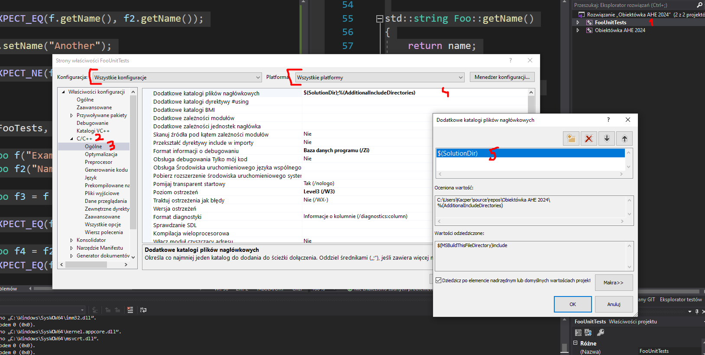

# Konfiguracja Visual Studio do testowania
1. Instalacja adaptera Google test

Narzędzia -> Pobierz narzędzia i funkcje - > Pojedyńcze składniki - > Adapter for google test

2. Utworzenie projektu dla testów

Prawy na rozwiązanie -> Dodaj -> Nowy Projet -> Google Test
Ścieżka bez zmian

2. i pół, alternatywnie dla kroku 3 i 5
Skopiuj pliki .h i .cpp klas do folderu z projektem z testami i dodaj je jak na screenie nizej

3. Dodanie ścieżki z plikami .h w ustawieniach projektu

Wybierz wszystkie konfiguracje i wszystkie platformy
Prawym na projekt z testami -> Właściwości -> C/C++ -> Ogólnie -> Dodatkowe katalogi plików nagłówkowych Dodajemy $(SolutionDir)

4. Usuwanie pch.h i pch.cpp

Wybierz wszystkie konfiguracje i wszystkie platformy
Prawym na projekt z testami -> Właściwości -> C/C++ -> Prekompilowane nagłówki -> Prekompilowany nagłówek - > Prekompilowane nagłówki nie są używane 

5. Linkowanie plików obj z naszymi klasami

Wybierz wszystkie konfiguracje i wszystkie platformy
Prawym na projekt z testami -> Właściwości -> Konsolidator -> Dane wejściowe -> Dodatkowe zależności -> Ustawiamy na ścieżke do konkretnego pliku obj znajdującego się w folderze debug projektu ktory chcemy testować (na screenie dla klasy Foo)

6. Kompilowanie i uruchamianie testów

Prawym na projet z kodem -> Kompiluj
Prawym na projekt z testami -> Ustaw projekt jako startowy
Mozna uruchamiać testy

